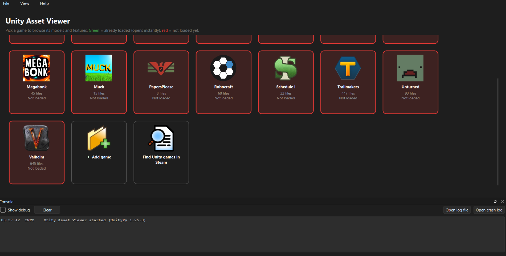

<div align="center">



# UniView - Game Asset Viewer

**Browse the 3D models, maps, textures, sprites, sounds, animations and text inside Unity, Source, Source 2, Unreal and Fallout 1/2 games, including games that have shut down and can't be played anymore. Any other game's loose files open too, and new engines can be added with plugins.**

[](https://hits.sh/github.com/NightHawkHSI/UniView/)
[](https://github.com/NightHawkHSI/UniView/releases)
[](https://github.com/NightHawkHSI/UniView/releases/latest)
[](https://github.com/NightHawkHSI/UniView/releases/latest)
<br>
[](https://github.com/NightHawkHSI/UniView/releases/latest)
[](#run-from-source)
[](https://github.com/NightHawkHSI/UniView/stargazers)
[](https://github.com/NightHawkHSI/UniView/commits/main)
[](https://github.com/NightHawkHSI/UniView)

### [](https://github.com/NightHawkHSI/UniView/releases/latest)

Unzip it and run `UniView.exe`. You don't need Python.

[Download](#download) · [Screenshots](#screenshots) · [Engines](#supported-engines) · [Features](#features) · [How to use](#how-to-use) · [Plugins](#engine-plugins) · [Compatibility](#game-compatibility-list) · [Build](#build) · [FAQ](#faq)


</div>

---

## At a glance

| | |
|---|---|
| **What it opens** | Unity, Source, Source 2, Unreal and Fallout 1/2 game folders; loose files and zip archives of any game; any engine that has a [plugin](#engine-plugins) |
| **What it shows** | Models and maps (3D), textures, sprites, sounds (built-in player), animations (played on their models), text files; everything else can be exported as-is |
| **What it exports** | Models as `.obj` + `.mtl` + `.png` or a single `.glb` (both open textured in Blender), textures as `.png`, sounds as `.wav`/`.mp3`/`.ogg`, animations as JSON keyframes, text as-is |
| **Game files** | Read only. UniView never changes anything |
| **Tested with** | Robocraft, Muck, Valheim (Unity) · Team Fortress 2, Portal (Source) · CS2, Deadlock (Source 2) · Satisfactory, Headliners, Dead as Disco (Unreal) · Fallout 1 & 2 · Project Zomboid, Serious Sam 2 (loose files) |
| **Built with** | [UnityPy](https://github.com/K0lb3/UnityPy) · [PySide6](https://doc.qt.io/qtforpython-6/) · [PyVista](https://pyvista.org/) |

## Download

1. Go to the [**latest release**](https://github.com/NightHawkHSI/UniView/releases/latest).
2. Download `UniView-vX.Y.Z-win64.zip`.
3. Unzip it anywhere and run **`UniView.exe`**.

> Windows SmartScreen may warn you the first time because the exe isn't code-signed. Click **More info → Run anyway**.

## Screenshots

**Projects page**: one box per game. Green means loaded, red means not loaded, and each box shows its file count. The console at the bottom shows what the app is doing.


**Game view**: the asset list with thumbnails on the left, the 3D model in the middle, and model info plus materials/textures on the right.


## Supported engines

Each game is read by an **engine plugin**. UniView picks the plugin automatically. To choose one yourself, right-click a game and use **Read with engine**.

| Engine | Games (examples) | Models | Textures | Sound | Other |
|---|---|---|---|---|---|
| **Unity** | Valheim, Muck, Among Us, Robocraft | ✔ with materials | ✔ + sprites | ✔ AudioClips | ✔ text; animations play on their skinned models, export as JSON |
| **Source** | TF2, HL2, Portal, CS:S, L4D2, GMod | ✔ `.mdl` with `.vmt` materials; ✔ **maps** (`.bsp`) with terrain and static props | ✔ `.vtf` | ✔ wav/mp3 | ✔ text |
| **Source 2** | CS2, Dota 2, Deadlock, HL: Alyx | ✔ `.vmdl_c` with materials | ✔ `.vtex_c` | ✔ `.vsnd_c` | ✔ text |
| **Unreal 4/5** | Satisfactory, Dead as Disco, Headliners | ✔ static + skeletal meshes, textures found through their materials | ✔ incl. virtual textures | ✔ Ogg/WAV SoundWaves, Wwise `.wem`, FMOD `.bank`* (not Bink Audio yet) | ✔ ini/json/csv...; raw export of the rest |
| **Fallout 1/2** | Fallout, Fallout 2 | – | ✔ FRM sprites (whole animation strip), RIX images | ✔ ACM* | ✔ MSG text |
| **Loose files & archives** | any other game (Project Zomboid, Serious Sam 2...) | ✔ `.obj`, DirectX `.x` | ✔ png/jpg/tga/dds/bmp... | ✔ wav/mp3/ogg, plus anything vgmstream* plays | ✔ text; files inside `.zip`/`.gro`/`.pk3` archives |

\* Needs the free **vgmstream** decoder: **Help → Install sound decoder (vgmstream)** downloads it once (from its official GitHub releases) into `tools/` next to UniView.

- **Textures per part**: models with several materials show each part with its own texture.
- **Maps**: Source `.bsp` maps show the whole level with textures, terrain (displacements) and all static props; the 3D skybox is left out.
- **Sounds** play in a built-in player (play/pause, seek, volume, autoplay) and save as `.wav`/`.mp3`/`.ogg`.
- **Animations** (Unity): each clip lists the bones it moves; pick a model with a matching skeleton and press **Play on model** to watch it (play/pause and a time slider), or save the keyframes as JSON. Humanoid (muscle) clips can't be played yet.

Unreal notes:
- Both `.pak` files and IoStore containers (`.utoc`/`.ucas`) are read. Packages are sorted into models, textures and other files by the class stored in their headers. The first time a game opens, this takes a few seconds; the result is cached in `cache/`.
- **Encrypted games** need the game's AES key: right-click the game → **Engine settings (Unreal)...** and paste it (one per line if there are several). Without it, UniView tells you which containers were skipped.
- Oodle-compressed files work if an `oo2core_*_win64.dll` is found. Many games ship one, and UniView looks in the game's folder, next to `UniView.exe` and in your Steam libraries.
- Models and textures are found by their data layout instead of the game's property schema, so no `.usmap` mappings file is needed. Nanite-only meshes and UE3 games (`.upk`) aren't supported.

## Features

**Finding things**
- **Search with filters**: type a name, or add filters like `tris>1000`, `size>1mb`, `w>=512` or `type:mesh`. Combine them, e.g. `gun tris>2000 size<5mb`.
- **Sortable columns**: click Name, Info (triangles or pixel size) or Size to sort. Every asset is measured in the background.
- **Favorites**: press Ctrl+D (or right-click) to star the good stuff, then pick **★ Favorites** in the type box to see only those. Favorites are saved per game.
- **Grid view**: big thumbnails you can flip through with the arrow keys (View → Grid, or Ctrl+2).
- **Jump between related assets**: double-click a model's texture to jump to it. A texture lists every model that uses it (click one to jump back), and a sprite links to its sprite sheet.

**Model viewer**
- Rotate, and zoom with the mouse wheel or +/−. Wireframe, edges, vertex colors and texture alpha can each be toggled on and off. The model's texture is found automatically.
- **UV sets**: switch between UV0/UV1/... (UV1 is often the baked-lighting layout), and use **UV layout** to see the UVs drawn over the texture.
- **Model panel**: vertex/triangle counts, the source file, the prefab path, what uses the model, and its materials and textures.
- **Animation playback**: play Unity animation clips on their skinned models.
- **Texture viewer**: zoom under the mouse, drag to pan, with a checkerboard background for transparency.

**Export**
- **OBJ + MTL + PNG** or **GLB** (one file with the textures inside).
- **Open in Blender** (Ctrl+B): exports the model and opens it in Blender in one click. Blender is found automatically, or you can point to it.
- **Bulk export** of all models, all textures, everything shown in the list, or a selection. It can **keep the game's folder structure** (e.g. `assets/prefabs/weapons/...`) so big dumps stay easy to browse.

**Projects page**
- A box for each game. **Green** means its assets are already loaded; **red** means they aren't loaded yet. Each box shows file/asset counts and how well the game works with UniView.
- **Drag and drop** a game folder onto the page to add it, or use **Find games in Steam**, which lists every game an engine plugin recognizes.
- **Engine and version**: each box shows the engine and what UniView can tell about it without loading the game, e.g. `Unity 2019.4.40f1 · IL2CPP`, `Source · tf, hl2`, `UE 4.26-5.2 · pak v11 · Oodle`.
- **Catalog your library**: tag games (right-click → Tags..., e.g. `lowpoly`, `fps`, `dead game`), then search, filter by tag, group by tag / engine / engine version / compatibility / loaded, and sort by name, engine version or asset count. The search box takes filters like `tag:lowpoly engine:unity version:2019 il2cpp`.
- **Pin** favorite games to the top. The most recently opened games come next.
- **Notes** for each game (right-click → Notes, or the Notes button in the viewer) for quirks and where the good stuff is.
- **Progress bar** while a game loads, plus a **console**, `viewer.log` and `crash.log`.

## How to use

1. Start UniView. The **Projects** page opens.
2. Click **Find games in Steam**, or **＋ Add game** and pick a game's install folder (e.g. `...\steamapps\common\Robocraft`).
3. Click a game's box to load it.
4. Pick an asset in the list on the left:
   - **Model**: rotate it in 3D and check its textures in the right-hand panel. **Save model + textures** exports it.
   - **Texture**: zoom and pan it. **Save PNG** exports it.
   - **Sound**: press Play (or turn on Autoplay). **Save sound...** exports it.
   - **Animation**: pick a model and press **Play on model**.
5. Search, sort and star assets (Ctrl+D). Switch to the grid (Ctrl+2) to flip through thumbnails. Right-click assets for more options. Use **File → Export …** for bulk export.
6. **← Projects** takes you back. Right-click a game's box to rename it, unload it from memory, or remove it.

## Engine plugins

Is there a game UniView can't read? You can teach it a new engine without touching UniView's code:

1. Copy `plugins/_template.py` (next to `UniView.exe`) to `plugins/my_engine.py`.
2. Fill in how to recognize the game's folder and how to read its models and textures.
3. Restart UniView. **Help → Engine plugins** shows what loaded.

The template is already a working "loose files" plugin (images, text and `.obj` models), so you can start from something that runs. [**PLUGINS.md**](PLUGINS.md) explains the API: assets, mesh conventions, materials and the helpers for Valve VPK and Unreal pak archives. A plugin with the same id as a built-in one replaces it, so you can also fix or extend the built-in engines. Pull requests for new engines are welcome.

## Run from source

Needs Python 3.10+ on Windows.

```
py -m pip install -r requirements.txt
run.bat
```

Or open a game folder directly: `py unity_viewer.py "D:\SteamLibrary\steamapps\common\Robocraft"`

## Build

```
build.bat
```

This creates:

- `Builds\GitHub`: a clean copy of the source (this repo)
- `Builds\Release\UniView-vX.Y.Z\`: a standalone app (no Python needed), plus a `.zip` of it for a GitHub release

The packaged exe is automatically self-tested after building. To also test it against a real game:
`build.bat release --test-game "D:\SteamLibrary\steamapps\common\Robocraft"`

The version number is `__version__` at the top of `unity_viewer.py`.

## FAQ

**A model shows no texture.**
Not every model can be traced back to a material. Right-click any texture in the list and choose **Apply as texture to current model**.

**A model looks see-through or odd.**
Leave **Texture alpha** off. Many games store other data in the alpha channel. If the texture is upside down, try **Flip texture V**.

**Something crashed or didn't load.**
Check the **Console**, or open `crash.log` / `viewer.log` next to `UniView.exe`. Please attach them when you [open an issue](https://github.com/NightHawkHSI/UniView/issues).

**Why GLB and not FBX?**
Blender can't import text-format FBX, and there's no simple Python writer for binary FBX. GLB (glTF) opens directly in Blender, Godot, Unity and most other tools, keeps the textures inside, and has room for bones and animation later.

**Does it use a lot of memory?**
Loaded games stay in memory so they reopen instantly. Right-click a game → **Unload from memory** to free it.

## Game compatibility list

[`compat.json`](compat.json) is a community list of how well UniView works with each game (**works**, **partial** or **broken**, plus notes and the Unity version it was built with). UniView downloads the latest version at startup and shows it on each game's box. You can turn this off under **Help**.

To add or update a game, right-click it in UniView → **Report compatibility...**. That opens a GitHub issue already filled in with the game's details. You can also send a pull request that edits `compat.json`. The key is the game's install folder name (e.g. `steamapps/common/Robocraft` → `"Robocraft"`).

## Notes

- Extracted assets are still owned by the game's creators. Viewing them for personal use is fine, but check before sharing them.
