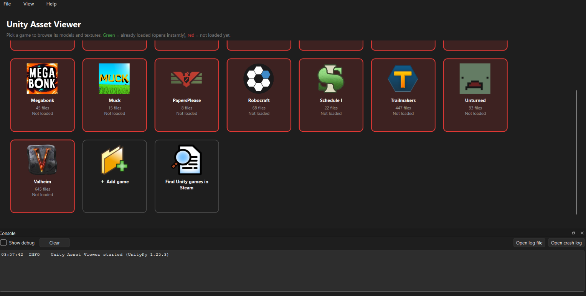
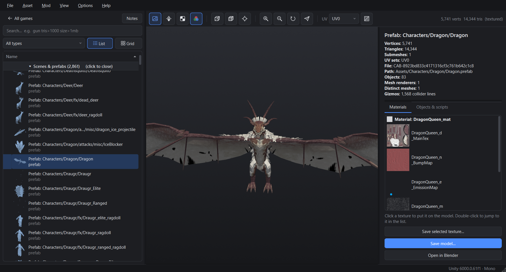
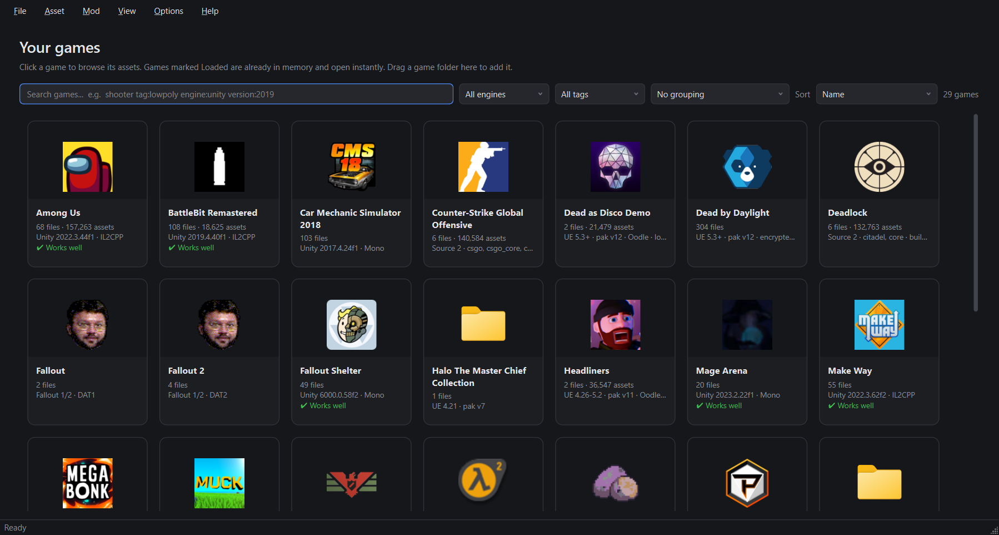
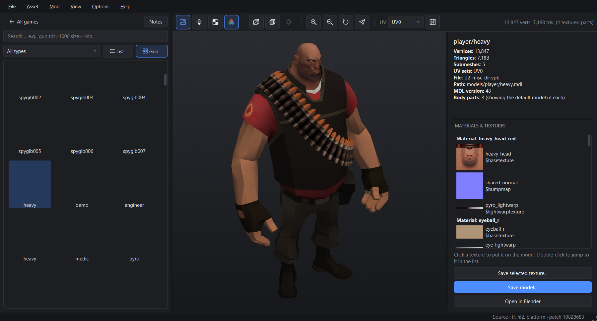
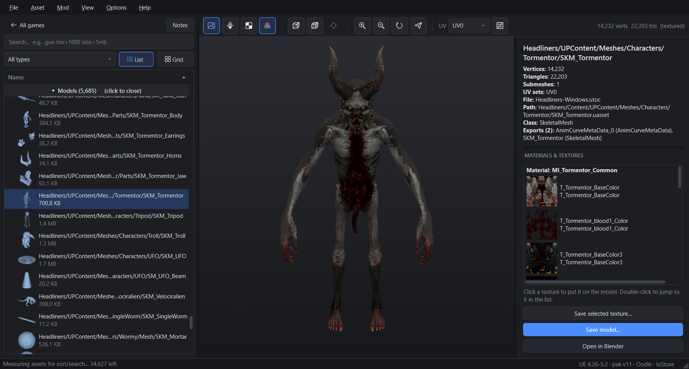
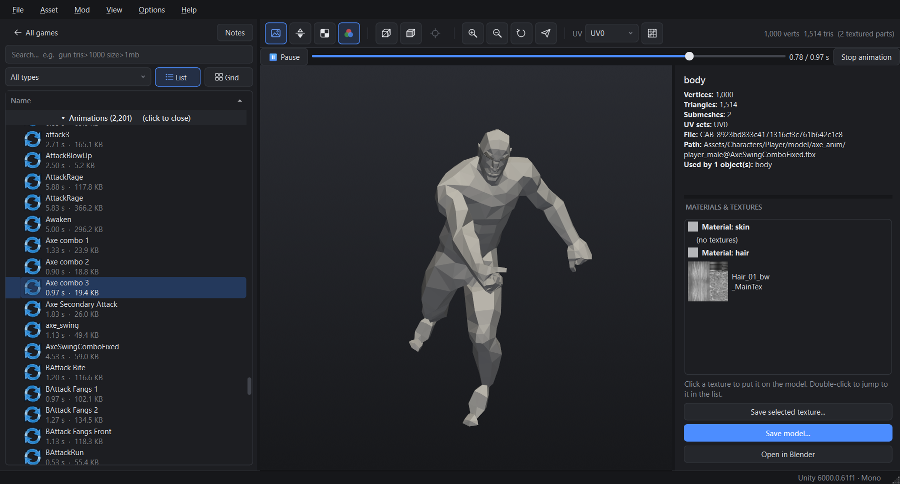
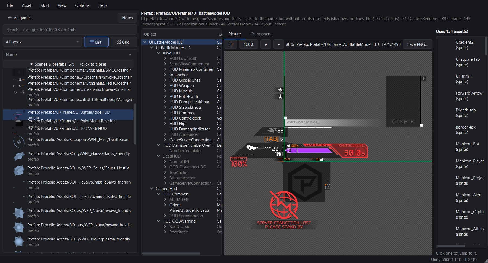
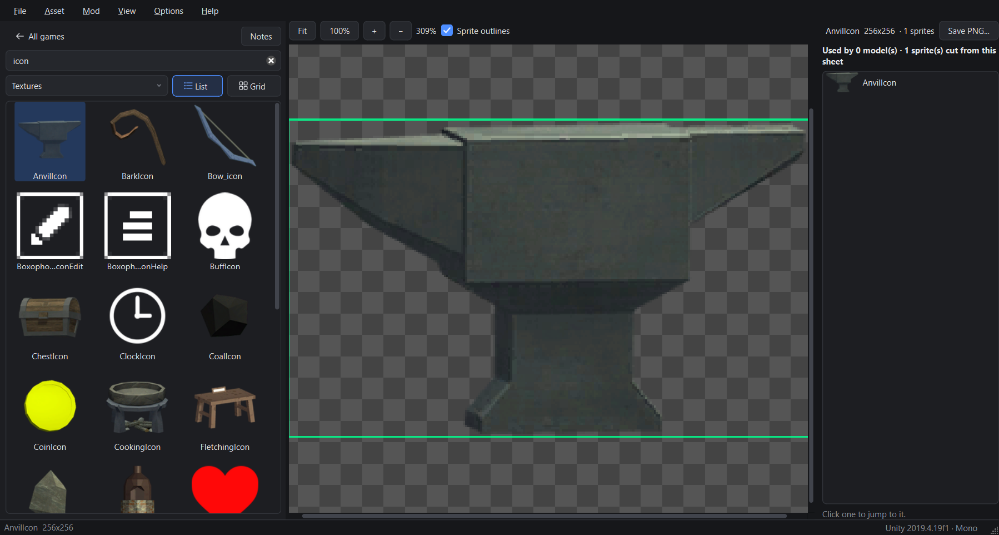
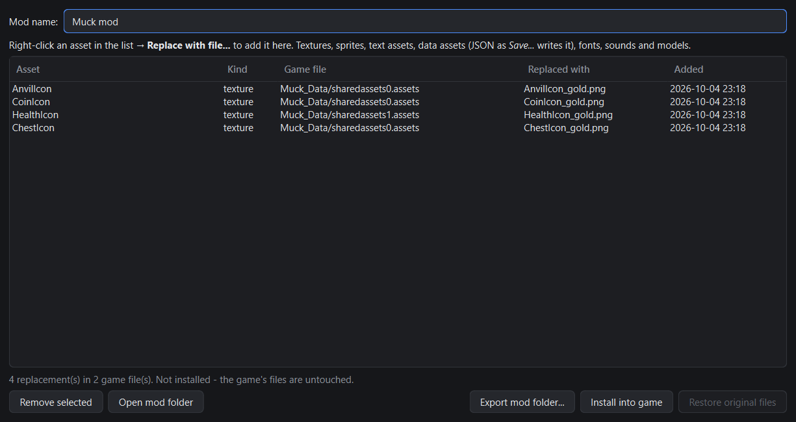

<div align="center">



# UniView - Game Asset Viewer

**Browse the 3D models, maps, textures, sprites, sounds, animations and text inside Unity, Source, Source 2, Unreal and Fallout 1/2 games, including games that have shut down and can't be played anymore. Any other game's loose files open too, and new engines can be added with plugins.**

[](https://hits.sh/github.com/NightHawkHSI/UniView/)
[](https://github.com/NightHawkHSI/UniView/releases)
[](https://github.com/NightHawkHSI/UniView/releases/latest)
[](https://github.com/NightHawkHSI/UniView/releases/latest)
<br>
[](https://github.com/NightHawkHSI/UniView/releases/latest)
[](#run-from-source)
[](https://github.com/NightHawkHSI/UniView/stargazers)
[](https://github.com/NightHawkHSI/UniView/commits/main)
[](https://github.com/NightHawkHSI/UniView)

### [](https://github.com/NightHawkHSI/UniView/releases/latest)

Unzip it and run `UniView.exe`. You don't need Python.

[Download](#download) · [Screenshots](#screenshots) · [Engines](#supported-engines) · [Features](#features) · [Modding](#modding-unity-games) · [How to use](#how-to-use) · [Plugins](#engine-plugins) · [Compatibility](#game-compatibility-list) · [Build](#build) · [FAQ](#faq)



<sub>Valheim's dragon with its full material: color, normal, emission and metallic maps, all exported with the model.</sub>

</div>

---

## At a glance

| | |
|---|---|
| **What it opens** | Unity, Source, Source 2, Unreal and Fallout 1/2 game folders; loose files and zip archives of any game; any engine that has a [plugin](#engine-plugins) |
| **What it shows** | Models and maps (3D), textures, sprites, sounds (built-in player), animations (played on their models), text files; everything else can be exported as-is |
| **What it exports** | Models as `.obj` + `.mtl` + `.png` or a single `.glb` with their full PBR materials (color, normal, metallic, roughness, AO, emission, height), textures as `.png`, sounds as `.wav`/`.mp3`/`.ogg`, animations as JSON keyframes or a rigged, animated `.glb`, text as-is, or a whole Unity game as a **Unity project** |
| **Modding** | Swap textures, sprites, text, data, fonts, sounds and models in Unity games with the [Mod Maker](#modding-unity-games) |
| **Game files** | Only read. The one exception is **Mod Maker → Install into game**, which backs up the originals first and can restore them |
| **Tested with** | Robocraft, Muck, Valheim (Unity) · Team Fortress 2, Portal (Source) · CS2, Deadlock (Source 2) · Satisfactory, Headliners, Dead as Disco (Unreal) · Fallout 1 & 2 · Project Zomboid, Serious Sam 2 (loose files) |
| **Built with** | [UnityPy](https://github.com/K0lb3/UnityPy) · [PySide6](https://doc.qt.io/qtforpython-6/) · [PyVista](https://pyvista.org/) |

## Download

1. Go to the [**latest release**](https://github.com/NightHawkHSI/UniView/releases/latest).
2. Download `UniView-vX.Y.Z-win64.zip`.
3. Unzip it anywhere and run **`UniView.exe`**.

> Windows SmartScreen may warn you the first time because the exe isn't code-signed. Click **More info → Run anyway**.

## Screenshots

**Your game library**: one card per game, with its engine, version, file count and how well it works. Search, tag, group and sort them.



<table>
<tr>
<td width="50%"><br><b>Source</b>: TF2's Heavy with his <code>.vmt</code> materials (base texture, normal map, light warp).</td>
<td width="50%"><br><b>Unreal</b>: a skeletal mesh from Headliners (IoStore + Oodle), textures found through its material instance.</td>
</tr>
<tr>
<td><br><b>Animations</b>: Valheim's "Axe combo 3" playing on the player model. Save it as a rigged, animated GLB.</td>
<td><br><b>UI prefabs</b>: Procelio's battle HUD drawn the way the game lays it out, with its object tree and every sprite it uses.</td>
</tr>
<tr>
<td><br><b>Grid view + texture viewer</b>: flip through thumbnails; sprite outlines show what is cut from each sheet.</td>
<td><br><b>Mod Maker</b>: collect replacements, then install them into the game (with a backup) or export a mod folder.</td>
</tr>
</table>

## Supported engines

Each game is read by an **engine plugin**. UniView picks the plugin automatically. To choose one yourself, right-click a game and use **Read with engine**.

| Engine | Games (examples) | Models | Textures | Sound | Other |
|---|---|---|---|---|---|
| **Unity** | Valheim, Muck, Among Us, Robocraft, Megabonk | ✔ with materials and their colors; ✔ **scenes & prefabs** (every object placed); ✔ **terrains** | ✔ + sprites, sprite sheets, 2D animations | ✔ AudioClips | ✔ text; fonts (.ttf/.otf); videos; **scripts & data** (item stats, configs...); animations (generic and humanoid) play on their skinned models and export as animated GLB |
| **Source** | TF2, HL2, Portal, CS:S, L4D2, GMod | ✔ `.mdl` with `.vmt` materials; ✔ **maps** (`.bsp`) with terrain and static props | ✔ `.vtf` | ✔ wav/mp3 | ✔ text |
| **Source 2** | CS2, Dota 2, Deadlock, HL: Alyx | ✔ `.vmdl_c` with materials | ✔ `.vtex_c` | ✔ `.vsnd_c` | ✔ text |
| **Unreal 4/5** | Satisfactory, Dead as Disco, Headliners | ✔ static + skeletal meshes, textures found through their materials | ✔ incl. virtual textures | ✔ Ogg/WAV SoundWaves, Wwise `.wem`, FMOD `.bank`* (not Bink Audio yet) | ✔ ini/json/csv...; raw export of the rest |
| **Fallout 1/2** | Fallout, Fallout 2 | – | ✔ FRM sprites (whole animation strip), RIX images | ✔ ACM* | ✔ MSG text |
| **Loose files & archives** | any other game (Project Zomboid, Serious Sam 2...) | ✔ `.obj`, DirectX `.x` | ✔ png/jpg/tga/dds/bmp... | ✔ wav/mp3/ogg, plus anything vgmstream* plays | ✔ text; files inside `.zip`/`.gro`/`.pk3` archives |

\* Needs the free **vgmstream** decoder: **Help → Optional tools...** downloads it once (from its official GitHub releases) into `tools/` next to UniView. UniView offers this at startup when it's missing.

- **Textures per part**: models with several materials show each part with its own texture. Materials without a texture show their color (and export it in GLB/OBJ); the info panel shows each material's color swatch, and hovering a material lists its shader values.
- **Fonts, videos, scripts & data** (Unity): fonts preview as a sample sheet and save as `.ttf`/`.otf`; VideoClips play in a built-in video player; named MonoBehaviours / ScriptableObjects (item stats, loot tables, dialogue, configs) show every field as readable text and save as JSON. Script fields are read from the game's own code (Mono, or IL2CPP's `GameAssembly.dll` + `global-metadata.dat`), each asset is labeled with its class, and references to other objects say what they point to (e.g. `icon → Texture2D 'ItemBattery'`). Games that use Addressables (`StreamingAssets/aa`) load too, and models find textures stored in other bundles.
- **Scenes & prefabs** (Unity): open a level or a prefab to see every object in place, with static batching, hidden objects and lower-detail LODs handled. Sprites (2D games), particle effects (as still puffs) and line renderers show too, and the **Gizmos** switch draws colliders, light ranges, cameras and sound sources as wire shapes; mostly-2D scenes open straight on.
- **UI prefabs** (Unity): HUDs, menus and crosshairs are drawn as a 2D picture the way the game lays them out (anchors, layout groups, sliced/filled images, masks, Shadow/Outline), with the game's own TextMeshPro fonts and their outline/drop-shadow. Click an object in the tree to outline it. Prefabs with nothing to draw (sounds, logic) show their objects, every component's values and the sprites/sounds/textures they use, with links.
- **Terrains** (Unity): terrain heightmaps show as 3D ground (listed as `Terrain: name`, and inside their scenes), painted with the terrain layers blended by their splat maps. Holes are cut out.
- **Sprite sheets & 2D animations** (Unity): a texture outlines every sprite cut from it (toggle **Sprite outlines**) and lists them; a sprite animation clip plays frame by frame with **Play sprite animation**.
- **Maps**: Source `.bsp` maps show the whole level with textures, terrain (displacements) and all static props; the 3D skybox is left out.
- **Sounds** play in a built-in player (play/pause, seek, volume, autoplay) and save as `.wav`/`.mp3`/`.ogg`.
- **Animations** (Unity): each clip lists the bones it moves; pick a model with a matching skeleton and press **Play on model** to watch it (play/pause and a time slider), press **Save animated GLB...** for a rigged, animated model that opens in Blender, or save the keyframes as JSON. Humanoid (muscle) clips play on any humanoid character: each character's Avatar turns the muscle values into its own bone rotations, the way Unity does.

Unreal notes:
- Both `.pak` files and IoStore containers (`.utoc`/`.ucas`) are read. Packages are sorted into models, textures and other files by the class stored in their headers. The first time a game opens, this takes a few seconds; the result is cached in `cache/`.
- **Encrypted games** need the game's AES key: right-click the game → **Engine settings (Unreal)...** and paste it (one per line if there are several). Without it, UniView tells you which containers were skipped.
- Oodle-compressed files work if an `oo2core_*_win64.dll` is found. Many games ship one, and UniView looks in the game's folder, next to `UniView.exe` and in your Steam libraries.
- Models and textures are found by their data layout instead of the game's property schema, so no `.usmap` mappings file is needed. Nanite-only meshes and UE3 games (`.upk`) aren't supported.

## Features

### Finding things

- **Search inside files** (Ctrl+Shift+F, any engine): find which assets contain a piece of text (an ID, a line of dialogue, a config key), with the text around each match; double-click to open it.
- **Inspect any file** (Ctrl+R, any engine): see what an asset's bytes are - text in its own encoding (UTF-16, Shift-JIS, Windows-1252...), images or archives hidden inside, or readable strings plus a hex dump. Files without a preview open this way.
- **Duplicate finder** (Asset → Find duplicate assets, any engine): groups identical assets (e.g. the same texture shipped in five bundles), shows how much space the copies take, and can hide the extra copies in the list.
- **Game versions** (File → Game versions, any engine): save a snapshot of a game, and after it updates see what was added, removed or changed.
- **Search with filters**: type a name, or add filters like `tris>1000`, `size>1mb`, `w>=512` or `type:mesh`. Combine them, e.g. `gun tris>2000 size<5mb`.
- **Sortable columns**: click Name, Info (triangles or pixel size) or Size to sort. Every asset is measured in the background.
- **Favorites**: press Ctrl+D (or right-click) to star the good stuff, then pick **★ Favorites** in the type box to see only those. Favorites are saved per game.
- **Grid view**: big thumbnails you can flip through with the arrow keys (View → Grid, or Ctrl+2).
- **Jump between related assets**: double-click a model's texture to jump to it. A texture lists every model that uses it (click one to jump back), and a sprite links to its sprite sheet.

### Model viewer

- Rotate, and zoom with the mouse wheel or +/−. Wireframe, edges, vertex colors and texture alpha can each be toggled on and off. The model's texture is found automatically.
- **UV sets**: switch between UV0/UV1/... (UV1 is often the baked-lighting layout), and use **UV layout** to see the UVs drawn over the texture.
- **Model panel**: vertex/triangle counts, the source file, the prefab path, what uses the model, and its materials and textures.
- **Fly camera** (F): walk through scenes and maps like a game camera: WASD to move, Q/E down/up, drag to look around, Shift for speed, the mouse wheel sets the speed, double-click a spot to jump there. Scenes, maps and terrains open in it; walls stay drawn right up to the camera, so you can go inside buildings.
- **Animation playback**: play Unity animation clips (generic and humanoid) on their skinned models.
- **Texture viewer**: zoom under the mouse, drag to pan, with a checkerboard background for transparency.

### Export

- **OBJ + MTL + PNG** or **GLB** (one file with the textures inside). Every map of the material comes along and is plugged into the right slot: color, normal, metallic/roughness, ambient occlusion and emission (Blender wires them up on import), plus height (`disp` in the MTL; a PNG next to a GLB). Unity's packed normal maps are unpacked and its metallic/smoothness maps converted, so they look right outside the game. Skinned models (Unity) save to GLB with their skeleton and skin weights, and **Save animated GLB...** on an animation adds the clip, so a rigged, animated character opens in Blender.
- **Open in Blender** (Ctrl+B): exports the model and opens it in Blender in one click. Blender is found automatically, or you can point to it.
- **Bulk export** of all models, all textures, everything shown in the list, or a selection. It can **keep the game's folder structure** (e.g. `assets/prefabs/weapons/...`) so big dumps stay easy to browse.
- **Export as Unity project** (Unity games: right-click the game on the Projects page): a folder you open with Unity Hub, with the game's textures, models (GLB via Unity's glTFast package), materials, sounds, fonts and text, and its **prefabs and scenes rebuilt** by a small editor script the first time Unity opens it (menu **UniView → Rebuild prefabs and scenes**). The game's code comes along so prefabs and scenes keep their script components and saved values: Mono games ship their compiled assemblies (plus decompiled C# with the optional ILSpy tool); for IL2CPP games the optional **Cpp2IL** tool rebuilds the script classes from the game's metadata (fields and attributes only - the scripts don't run). Custom shaders aren't included: materials go on Unity's built-in Standard shader, with their normal, metallic, occlusion, height, emission and detail maps attached.

### Modding (Unity games)

- **Mod Maker** (Mod → Mod Maker, Ctrl+M): right-click a texture, sprite, text asset, data asset, font, sound or model → **Replace with file...** and pick your PNG / text / JSON / TTF / WAV, OGG, MP3, FLAC / GLB, OBJ. Sprites are pasted into their sprite sheet; data assets take the JSON that **Save...** writes, edited (fields keep their types). Sounds are stored uncompressed (16-bit PCM), so they take more space than the game's own. Models keep the game mesh's vertex layout: save the model as GLB, edit it in Blender, export GLB and replace; what your file doesn't have (lightmap UVs, a character's bone weights) is copied from the nearest original vertex, so reshaped characters keep their rig. Scene objects merged by Unity's static batching are drawn from the scene's *Combined Mesh*, not their own mesh.
- **Install into game** rewrites only the changed game files (`.assets` or AssetBundles), backs up the originals first, and reloads the game. **Restore original files** puts them back. **Export mod folder...** writes the modded files + a README to share instead. For Addressables games (`StreamingAssets/aa`), the catalog's CRC check is switched off for the modded bundles so the game still loads them.

### Projects page

- A box for each game. **Green** means its assets are already loaded; **red** means they aren't loaded yet. Each box shows file/asset counts and how well the game works with UniView.
- **Drag and drop** a game folder onto the page to add it, or use **Find games in Steam**, which lists every game an engine plugin recognizes.
- **Engine and version**: each box shows the engine and what UniView can tell about it without loading the game, e.g. `Unity 2019.4.40f1 · IL2CPP`, `Source · tf, hl2`, `UE 4.26-5.2 · pak v11 · Oodle`.
- **Catalog your library**: tag games (right-click → Tags..., e.g. `lowpoly`, `fps`, `dead game`), then search, filter by tag, group by tag / engine / engine version / compatibility / loaded, and sort by name, engine version or asset count. The search box takes filters like `tag:lowpoly engine:unity version:2019 il2cpp`.
- **Pin** favorite games to the top. The most recently opened games come next.
- **Notes** for each game (right-click → Notes, or the Notes button in the viewer) for quirks and where the good stuff is.
- **Progress bar** while a game loads, plus a **console**, `viewer.log` and `crash.log`.

## How to use

1. Start UniView. The **Projects** page opens.
2. Click **Find games in Steam**, or **＋ Add game** and pick a game's install folder (e.g. `...\steamapps\common\Robocraft`).
3. Click a game's box to load it.
4. Pick an asset in the list on the left:
   - **Model**: rotate it in 3D and check its textures in the right-hand panel. **Save model + textures** exports it.
   - **Texture**: zoom and pan it. **Save PNG** exports it.
   - **Sound**: press Play (or turn on Autoplay). **Save sound...** exports it.
   - **Animation**: pick a model and press **Play on model**.
5. Search, sort and star assets (Ctrl+D). Switch to the grid (Ctrl+2) to flip through thumbnails. Right-click assets for more options. Use **File → Export …** for bulk export.
6. **← Projects** takes you back. Right-click a game's box to rename it, unload it from memory, or remove it.

## Engine plugins

Is there a game UniView can't read? You can teach it a new engine without touching UniView's code:

1. Copy `plugins/_template.py` (next to `UniView.exe`) to `plugins/my_engine.py`.
2. Fill in how to recognize the game's folder and how to read its models and textures.
3. Restart UniView. **Help → Engine plugins** shows what loaded.

The template is already a working "loose files" plugin (images, text and `.obj` models), so you can start from something that runs. [**PLUGINS.md**](PLUGINS.md) explains the API: assets, mesh conventions, materials and the helpers for Valve VPK and Unreal pak archives. A plugin with the same id as a built-in one replaces it, so you can also fix or extend the built-in engines. Pull requests for new engines are welcome.

## Run from source

Needs Python 3.10+ on Windows.

```
py -m pip install -r requirements.txt
run.bat
```

Or open a game folder directly: `py unity_viewer.py "D:\SteamLibrary\steamapps\common\Robocraft"`

## Build

```
build.bat
```

This creates:

- `Builds\GitHub`: a clean copy of the source (this repo)
- `Builds\Release\UniView-vX.Y.Z\`: a standalone app (no Python needed), plus a `.zip` of it for a GitHub release

The packaged exe is automatically self-tested after building. To also test it against a real game:
`build.bat release --test-game "D:\SteamLibrary\steamapps\common\Robocraft"`

The version number is `__version__` in `uniview/__init__.py`.

## FAQ

**A model shows no texture.**
Not every model can be traced back to a material. Right-click any texture in the list and choose **Apply as texture to current model**.

**A model looks see-through or odd.**
Leave **Texture alpha** off. Materials the game marks as cutout (leaves, grass, fences) or transparent (glass, smoke) already use their alpha; the button forces it on every texture, and many games store other data in the alpha channel. If the texture is upside down, try **Flip texture V**.

**Something crashed or didn't load.**
Check the **Console**, or open `crash.log` / `viewer.log` next to `UniView.exe`. Please attach them when you [open an issue](https://github.com/NightHawkHSI/UniView/issues).

**Why GLB and not FBX?**
Blender can't import text-format FBX, and there's no simple Python writer for binary FBX. GLB (glTF) opens directly in Blender, Godot, Unity and most other tools, and keeps the textures, bones and animation inside one file.

**Does it use a lot of memory?**
Loaded games stay in memory so they reopen instantly. Right-click a game → **Unload from memory** to free it.

## Game compatibility list

[`compat.json`](compat.json) is a community list of how well UniView works with each game (**works**, **partial** or **broken**, plus notes and the Unity version it was built with). UniView downloads the latest version at startup and shows it on each game's box. You can turn this off under **Help**.

To add or update a game, right-click it in UniView → **Report compatibility...**. That opens a GitHub issue already filled in with the game's details. You can also send a pull request that edits `compat.json`. The key is the game's install folder name (e.g. `steamapps/common/Robocraft` → `"Robocraft"`).

## Privacy

UniView has no telemetry, accounts or ads. It only goes online for:

- the compatibility list (`compat.json` from this GitHub repository) at startup - turn it off under **Help**;
- optional tools you choose to install: vgmstream and Cpp2IL from their GitHub releases, ILSpy (`ilspycmd`) from NuGet and, if needed, the .NET runtime from Microsoft;
- Unity packages (e.g. glTFast) from Unity's package registry when you export a Unity project;
- **Report compatibility...**, which opens a *public* GitHub issue in your browser with the game's name, install folder name (not the full path), engine, file counts and your UniView version. Nothing is sent until you submit it.

## Legal Disclaimers

- UniView is free software under the [GNU General Public License v3.0](LICENSE). It is free and non-commercial. The source code of every release is in this repository, under the tag of that version.
- **No warranty.** UniView is provided "as is", without warranty of any kind (see sections 15 and 16 of the GPL). You use it at your own risk.
- **Game content belongs to its owners.** UniView contains no game assets, code or keys. Everything it shows comes from games you have installed yourself, and that content stays the property of its creators. Extract and use assets only for personal, educational, research or interoperability purposes, or with the rights holder's permission. Don't redistribute them, and don't publish Unity projects exported from a game: they contain the game's assets and code.
- **Game licenses and online games.** Extracting, decompiling or modding a game may be against its End User License Agreement or Terms of Service. Check them first. **Don't use Mod Maker on online or multiplayer games**: anti-cheat systems can detect changed files and ban accounts. Mod Maker keeps a backup when it installs a mod; you can also use your launcher's "verify game files" option to restore the original files.
- **Encryption.** UniView does not include, find or crack encryption keys and does not remove copy protection. Encrypted Unreal games only open with an AES key you supply, and you are responsible for having the right to use it. The laws on decrypting and decompiling software (for example the DMCA in the U.S. and the EU Software Directive) differ between countries; make sure your use is allowed where you live.
- **Decompiling.** The optional decompilers (ILSpy, Cpp2IL) are there so you can understand how game data is used, for interoperability and research. What you do with decompiled code is your responsibility.
- **Screenshots** in this README show game assets © their respective owners, for illustration only.
- **Rights holders:** if you believe UniView or something in this repository infringes your rights, [open an issue](https://github.com/NightHawkHSI/UniView/issues) and it will be looked at promptly.
- UniView is not sponsored by or affiliated with Unity Technologies, Epic Games, Valve Corporation, ZeniMax Media / Bethesda Softworks, Epic Games Tools (RAD Game Tools), or any game developer or publisher, or their affiliates.
- "Unity" is a registered trademark of Unity Technologies or its affiliates in the U.S. and elsewhere.
- "Unreal" and "Unreal Engine" are trademarks or registered trademarks of Epic Games, Inc. in the U.S. and elsewhere.
- "Source", "Steam" and "Valve" are trademarks or registered trademarks of Valve Corporation.
- "Fallout" is a trademark or registered trademark of ZeniMax Media Inc.
- "Oodle" is a trademark of Epic Games Tools LLC.
- "FMOD" is a trademark of Firelight Technologies Pty Ltd. UniView uses the FMOD Engine, copyright © Firelight Technologies Pty Ltd.
- All other trademarks and game names belong to their respective owners and are used only to identify compatible games.
- The [Credits](CREDITS.md) page contains a list of attributions.
